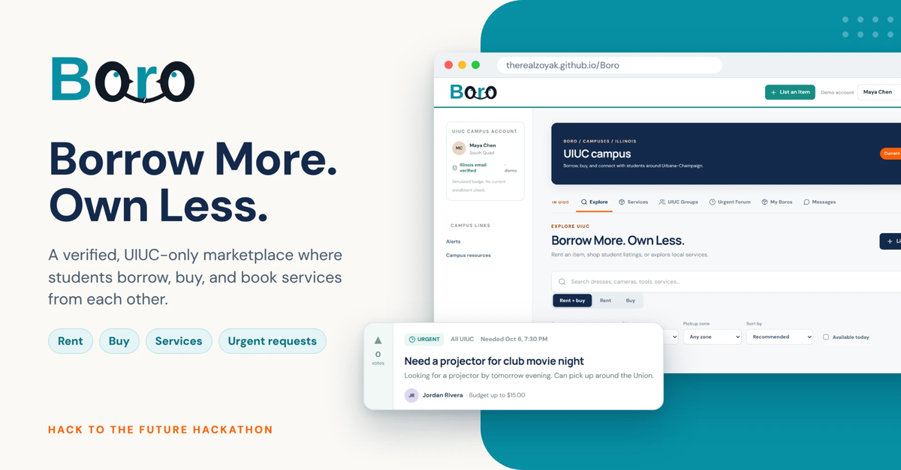
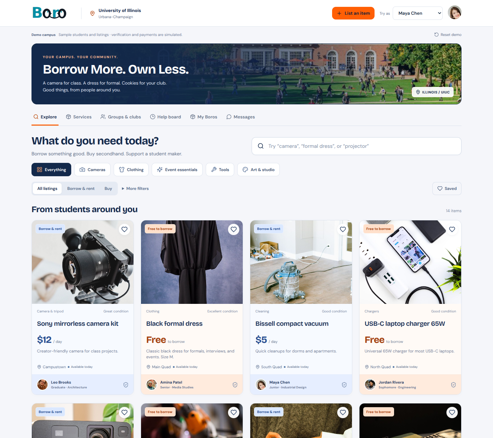
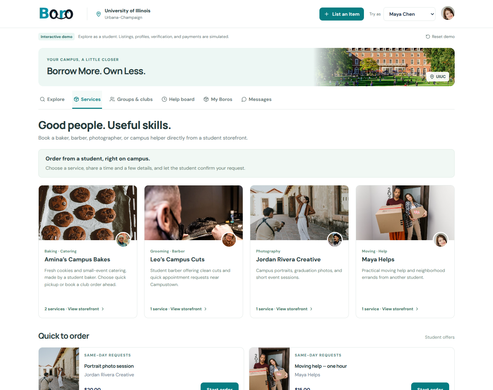
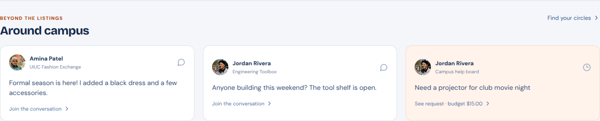
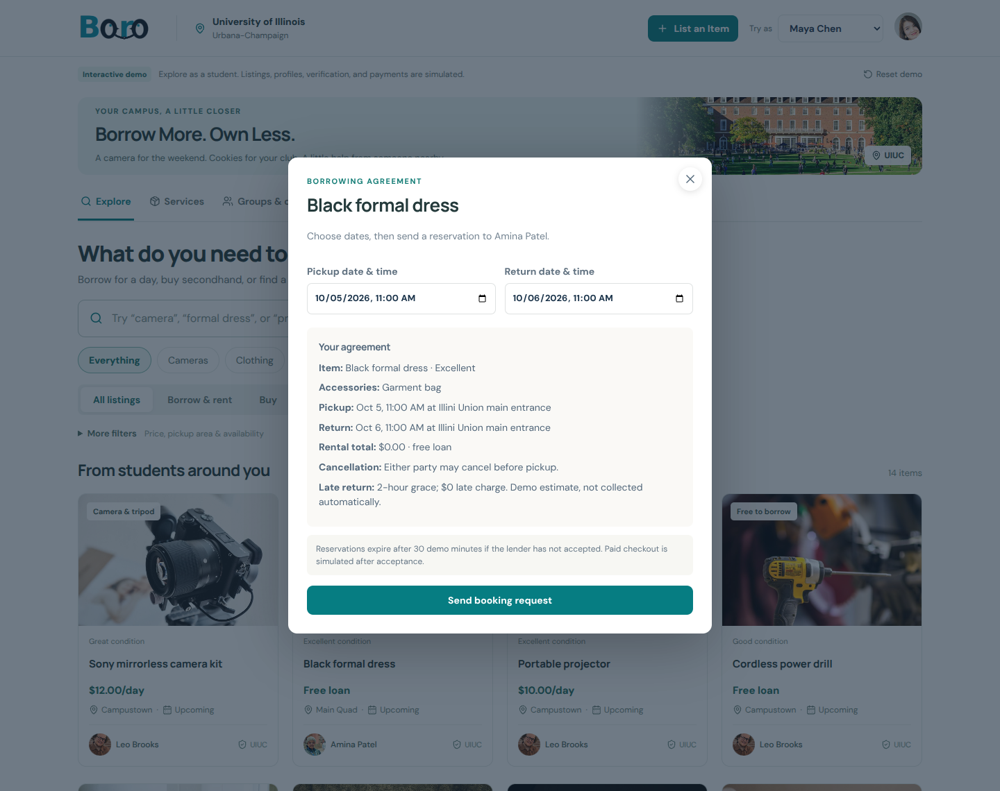
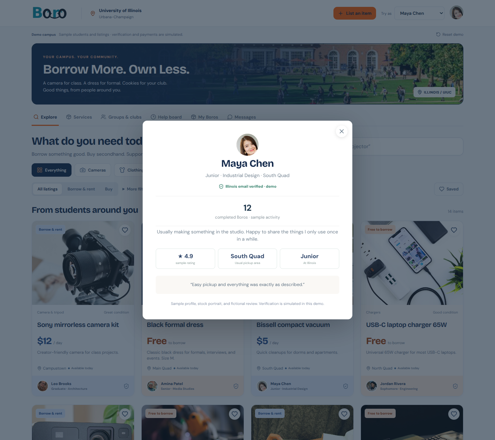
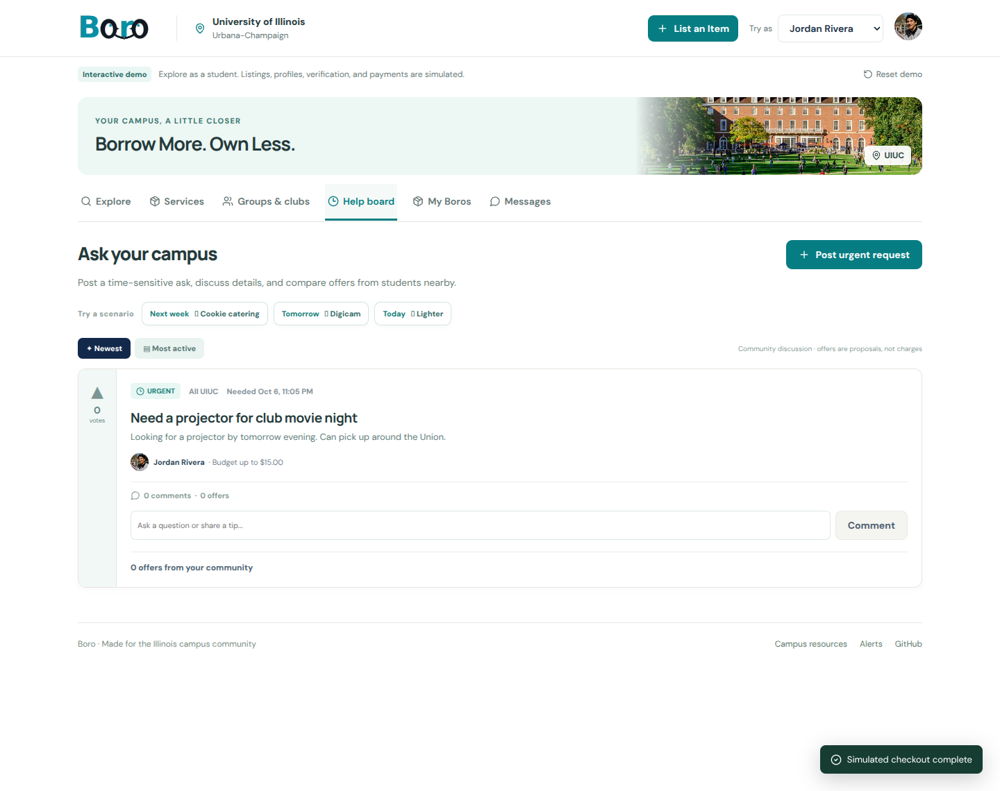
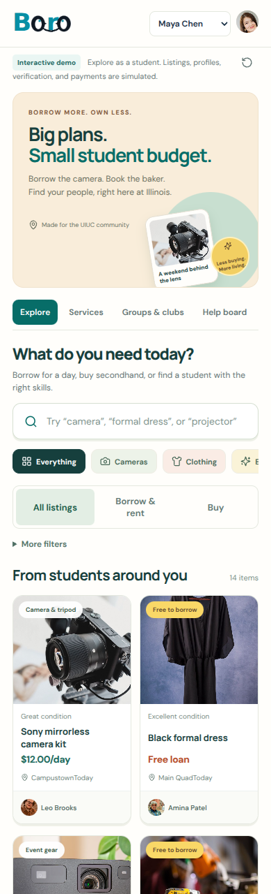

<p align="center">
  
</p>

<p align="center">
  A campus marketplace for borrowing, buying, and booking student services.
  <br />
  <strong><a href="https://therealzoyak.github.io/Boro/">Explore the live demo</a></strong>
  · <a href="#try-the-demo">Demo walkthrough</a>
  · <a href="TECH_STACK.md">Architecture</a>
  · <a href="https://boro-feedback.therealzoyak.chatgpt.site">Share feedback</a>
</p>



## Why Boro?

A camera for a class project. A dress for one formal. A projector for a club movie night. Students often need something briefly, while someone nearby already owns it. Meanwhile, student bakers, barbers, photographers, and clubs need a place to make their work discoverable beyond group chats and scattered posts.

Boro brings those exchanges into one UIUC campus marketplace: browse an item, agree on dates and pickup, or request a service directly from a student storefront.

Built by a **team of four**, **Back to the Basics**, for Product Space UIUC’s **Hack to the Future** hackathon and its accessibility prompt.

## What you can explore

| Experience | In the demo |
| --- | --- |
| **Borrow & rent** | Free loans and paid rentals, category and location filters, saved listings per demo account, date validation, borrowing agreements, pickup and return confirmation, and condition photos. |
| **Buy & try before buying** | Secondhand listings and lease-to-buy flows with rental credit and a simulated refundable deposit. |
| **Student storefronts** | Bakers, barbers, photographers, and moving help; requests include a preferred time, quantity, and order details. |
| **Groups & clubs** | Shared inventories, group feeds, member profiles, and public or private borrowing circles. |
| **Campus help board** | Time-sensitive requests, comments, upvotes, competing offers, and attached listings. |
| **Conversations** | Item-specific messaging, price proposals, counteroffers, and agreement updates. |

## A closer look

### Student businesses



### Campus conversations



### Clear borrowing agreements



<details>
  <summary>View student profiles, the help board, and mobile layout</summary>
  <br />





<p align="center">
  
</p>
</details>

## Try the demo

Open **[therealzoyak.github.io/Boro](https://therealzoyak.github.io/Boro/)**. No account, installation, or payment information is needed.

1. Start as **Maya Chen**. Search for **“formal dress”**, open the free listing, and request to borrow it.
2. Use the **Try as** selector to switch to **Amina Patel**. In **My Boros → Lending**, accept the request.
3. Switch back to Maya to confirm the loan. Both accounts can confirm pickup and handoff, then record and confirm the return.
4. Visit **Services** to request a cookie box or photo session. Explore **Groups & clubs** and the **Help board** for the community flows.

**Reset demo** restores the sample listings and clears your demo activity and filters.

### Help shape Boro

Use **Share feedback** at the top of the demo, or open the [feedback form](https://boro-feedback.therealzoyak.chatgpt.site). No account or name is required. Tell us what worked, what needs fixing, or what would make you use Boro on campus.

Feedback is saved in a separate private database, with the submission time, feedback category, optional interest response, and message. It is not stored in the marketplace’s browser-local demo data. The project owner can review responses in the **BORO · Share feedback** Site’s Settings database viewer, or request a response summary through ChatGPT. Responses are not displayed publicly.

> **Prototype scope:** Boro is an interactive front-end prototype, not an operating marketplace. Data and uploaded photos stay in the current browser's `localStorage`; messages are not shared between visitors. Student identities, reviews, memberships, verification badges, payments, deposits, and transaction history are fictional or simulated. No university credentials are collected and no money is charged. Private-group visibility is a demo behavior, not server-enforced access control.

## Built with

**React 19 · TypeScript 5.9 · Vite 7 · Lucide · Custom CSS · GitHub Pages**

The interface uses bundled, optimized photos and local DM Sans / Manrope fonts. It includes responsive layouts and separate borrowing, service-order, and lease state transitions. `src/demoServices.ts` provides a small boundary for replacing demo storage, account selection, and checkout with real services.

See **[TECH_STACK.md](TECH_STACK.md)** for the current architecture and proposed production integrations, and **[PHOTO_SOURCES.md](PHOTO_SOURCES.md)** for asset attribution.

## Run locally

Requires **Node.js 22+**.

```bash
npm ci
npm run dev
```

```bash
npm run build         # Type-check and build for root-path hosting
npm run build:pages   # Type-check and build for /Boro/ on GitHub Pages
npm run preview       # Preview the most recent build
```

The existing [deployment workflow](.github/workflows/deploy.yml) builds and publishes the demo on pushes to `main`. GitHub Pages uses **GitHub Actions** as its publishing source.

## Production direction

A real launch needs authenticated campus membership, a persistent database, server-side authorization and booking checks, live messaging, moderation, and a payment provider. The documented implementation path uses Supabase and Stripe Connect; these are **planned integrations**, not services connected to this demo.

Campus equipment resources link to university services and follow their own booking policies. Boro is an independent student project and is not affiliated with or endorsed by the University of Illinois.
